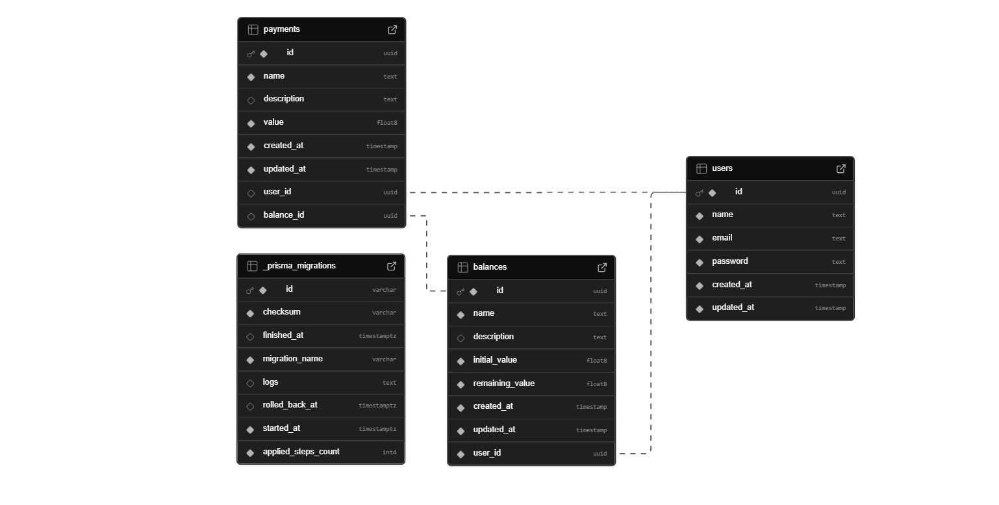

# Payments API

## Descrição
Este projeto é uma API desenvolvida com **NestJS**, projetada para gerenciar informações relacionadas a pagamentos e saldos de usuários. A API permite criar, atualizar e consultar saldos e pagamentos, além de fornecer autenticação via JWT. A aplicação está configurada para rodar em um ambiente **Docker**, com o banco de dados **PostgreSQL**.

## Pré-requisitos
Antes de executar a aplicação, é necessário ter as seguintes ferramentas instaladas:
* Docker
* Docker Compose
* Node.js (para desenvolver e testar localmente)

## Configuração do Projeto

### Passos para Executar o Projeto
1. **Build e Start no Docker Compose**

Para executar a aplicação e o banco de dados em containers Docker, execute o seguinte comando:
```bash
docker compose up --build
```
⚠️ ```A primeira instalação das dependências pode demorar um pouco```


2. **Verificando e usando a aplicação**

Depois de subir os containers, a API estará disponível em http://localhost:3000.

Para facilitar, as rotas podem ser acessadas e testadas através do endpoint http://localhost:3000/swagger.

3. **Autenticação na API**

- Envie uma requisição `POST` para a rota `/user` com o corpo da requisição contendo os dados do novo usuário:

```JSON
{
  "name": "Novo Usuário",
  "email": "novo.usuario@incentive.me",
  "password": "senha-do-usuario"
}
```


- Após criar o usuário, envie uma requisição `POST` para a rota `/auth/login` com o **email** e **password** do usuário criado. A resposta conterá o **token JWT**:
```JSON
  {
    "accessToken": "seu-token-jwt"
  }
```

4. **Adicionar o Token no Swagger**

- No Swagger, clique em "Authorize" no canto superior direito.

- Insira o token JWT obtido na etapa anterior no campo Bearer Token e clique em "Authorize".

- Agora, você pode fazer requisições para as rotas protegidas da API com o token autenticado.


5. **Prisma Studio**

Se desejar visualizar a base de dados, o serviço do Prisma Studio pode ser acessado através de http://localhost:5555.


### Como executar Testes
Primeiro execute `npm install` na raiz do projeto, após isso execute `npm run test:cov`.


### Configuração fora do ambiente Docker
Para testar fora do ambiente do Docker um arquivo `.env` com as variáveis `JWT_SECRET`, `DATABASE_URL` e `DIRECT_URL` deve ser criado.

Durante a execução local os valores `DATABASE_URL` e `DIRECT_URL` podem ser idênticos, porém, em outros ambientes (como por exemplo o Supabase) esses valores podem ser distintos.

Opcionalmente a dependência de directUrl pode ser removida do schema.prisma.

## Database
Diagrama ER simplificado, ilustrando a estrutura do banco de dados e seus principais relacionamentos.




## Cloud Run + Supabase

Esta aplicação está rodando no Google Cloud Run e utiliza Supabase como banco de dados.

### Acesso a API em Cloud Run
A aplicação pode ser acessada através de https://nestapp-incentiveme-334776019966.us-central1.run.app.

Assim como sua versão local, a rota https://nestapp-incentiveme-334776019966.us-central1.run.app/swagger está disponivel para facilitar a utilização.

⚠️ ```A primeira execução da aplicação pode ser um pouco mais lenta, pois o Cloud Run pode estar inicializando o ambiente de execução. Após a inicialização, as execuções subsequentes serão mais rápidas.```